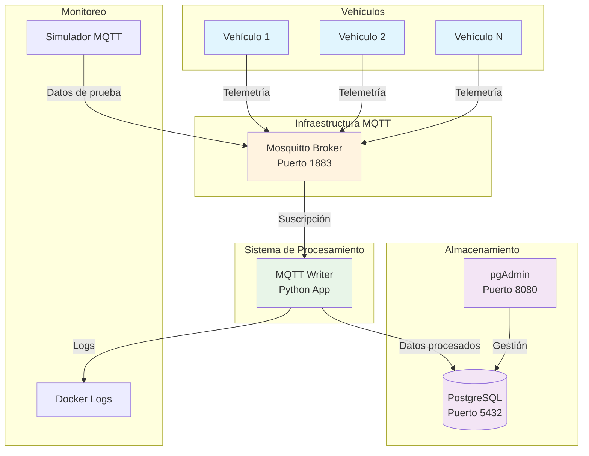
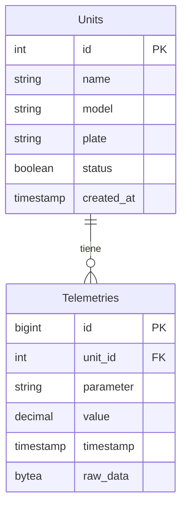

# 🚗 Sistema de Telemetría Vehicular MQTT → PostgreSQL

Sistema completo de telemetría vehicular que escucha mensajes MQTT y los almacena en una base de datos PostgreSQL. Diseñado para monitorear flotillas de vehículos en tiempo real con arquitectura escalable y containerizada.

## 📋 Tabla de Contenidos

- [Características](#-características)
- [Arquitectura del Sistema](#-arquitectura-del-sistema)
- [Estructura del Proyecto](#-estructura-del-proyecto)
- [Instalación y Configuración](#-instalación-y-configuración)
- [Uso del Sistema](#-uso-del-sistema)
- [Comandos Makefile](#-comandos-makefile)
- [Esquema de Base de Datos](#-esquema-de-base-de-datos)
- [Formato de Mensajes MQTT](#-formato-de-mensajes-mqtt)
- [Scripts Incluidos](#-scripts-incluidos)
- [Monitoreo y Diagnóstico](#-monitoreo-y-diagnóstico)
- [Desarrollo](#-desarrollo)
- [Troubleshooting](#-troubleshooting)

## ✨ Características

- 🔄 **Procesamiento en tiempo real** de mensajes MQTT
- 🐘 **Almacenamiento robusto** en PostgreSQL
- 🐳 **Completamente dockerizado** para fácil despliegue
- 📊 **Interfaz de administración** con pgAdmin
- 🛠️ **Makefile completo** con comandos útiles
- 🧪 **Simulador MQTT** incluido para testing
- 📝 **Logging detallado** para debugging
- 🔧 **Configuración flexible** via variables de entorno
- 🎯 **Scripts de ejemplo** y datos de prueba

## 🏗️ Arquitectura del Sistema



### Flujo de Datos

1. **Captura**: Los vehículos envían datos de telemetría via MQTT
2. **Procesamiento**: El servicio Python escucha los topics y procesa los mensajes
3. **Almacenamiento**: Los datos se guardan en PostgreSQL con timestamps
4. **Monitoreo**: pgAdmin permite visualizar y gestionar los datos

## 📁 Estructura del Proyecto

```
liese-av-geotel-mqtt-writter/
├── 📋 Makefile                    # Comandos de automatización
├── 🐳 docker-compose.yml          # Orquestación de servicios
├── 🐳 Dockerfile                  # Imagen del writer
├── 📦 requirements.txt            # Dependencias Python
├── ⚙️ .env                        # Variables de entorno (local)
├── ⚙️ .env.example               # Plantilla de configuración
├── 📖 README.md                   # Este archivo
│
├── 📁 src/                        # Código fuente principal
│   ├── 🐍 main.py                # Punto de entrada de la aplicación
│   ├── 📁 Schemas/               # Lógica de negocio
│   │   ├── 🐍 __init__.py
│   │   └── 🐍 Writer.py          # Procesador MQTT → DB
│   ├── 📁 Services/              # Servicios de infraestructura
│   │   ├── 🐍 __init__.py
│   │   └── 🐍 DatabaseConnection.py # Conexión y operaciones DB
│   └── 📁 Database/              # Scripts de base de datos
│       └── 📄 Diagrama AV.sql    # Esquema de la base de datos
│
├── 📁 scripts/                   # Scripts de utilidad
│   ├── 🐍 create_sample_data.py  # Datos de ejemplo
│   └── 🐍 simulate_mqtt.py       # Simulador de telemetría
│
└── 📁 docs/                      # Documentación adicional
    └── 📊 (diagramas y docs)
```

## 🚀 Instalación y Configuración

### Prerrequisitos

- Docker y Docker Compose
- Git
- Make (opcional, para comandos automatizados)

### Instalación Rápida

```bash
# 1. Clonar el repositorio
git clone <repository-url>
cd liese-av-geotel-mqtt-writter

# 2. Configurar variables de entorno
cp .env.example .env
# Editar .env según tus necesidades

# 3. Instalación completa con un comando
make setup
```

### Configuración Manual

```bash
# 1. Construir las imágenes
docker-compose build

# 2. Levantar los servicios
docker-compose up -d

# 3. Crear las tablas de la base de datos
make create-tables

# 4. Poblar con datos de ejemplo
make sample-data
```

### Variables de Entorno

Copia `.env.example` a `.env` y ajusta según tu entorno:

```env
# Base de Datos
POSTGRES_DB=geotel_db
POSTGRES_USER=geotel_user
POSTGRES_PASSWORD=geotel_password
POSTGRES_HOST=postgres
POSTGRES_PORT=5432

# MQTT
MQTT_BROKER=host.docker.internal  # Para usar Mosquitto del host
MQTT_PORT=1883
MQTT_USERNAME=
MQTT_PASSWORD=

# pgAdmin
PGADMIN_DEFAULT_EMAIL=admin@geotel.com
PGADMIN_DEFAULT_PASSWORD=admin123
```

## 🎮 Uso del Sistema

### Acceso a Interfaces

| Servicio | URL | Credenciales |
|----------|-----|--------------|
| **pgAdmin** | http://localhost:8080 | admin@geotel.com / admin123 |
| **PostgreSQL** | localhost:5432 | geotel_user / geotel_password |
| **MQTT Broker** | localhost:1883 | (sin autenticación) |

### Envío de Datos de Telemetría

Los mensajes MQTT deben seguir el formato: `U{ID}_{Parametro}`

```bash
# Ejemplos de mensajes
mosquitto_pub -h localhost -t "U1_Combustible" -m "75.5"
mosquitto_pub -h localhost -t "U1_Velocidad" -m "85.2"
mosquitto_pub -h localhost -t "U1_RPM" -m "2200"
mosquitto_pub -h localhost -t "U1_Temperatura" -m "89"
mosquitto_pub -h localhost -t "U1_Panic" -m "1"
```

### Consultas de Ejemplo

```sql
-- Ver todas las unidades
SELECT * FROM "Units";

-- Telemetría reciente de una unidad
SELECT * FROM "Telemetries" 
WHERE unit_id = 1 
ORDER BY timestamp DESC 
LIMIT 10;

-- Estadísticas por unidad
SELECT 
    u.name,
    COUNT(t.id) as total_registros,
    MAX(t.timestamp) as ultimo_registro
FROM "Units" u
LEFT JOIN "Telemetries" t ON u.id = t.unit_id
GROUP BY u.id, u.name;
```

## 🛠️ Comandos Makefile

### Comandos Principales

| Comando | Descripción |
|---------|-------------|
| `make help` | 📋 Mostrar todos los comandos disponibles |
| `make setup` | 🚀 Configuración completa inicial |
| `make build` | 🔨 Construir las imágenes Docker |
| `make up` | ⬆️ Levantar todos los servicios |
| `make down` | ⬇️ Detener todos los servicios |
| `make logs` | 📝 Ver logs del servicio principal |
| `make clean` | 🧹 Limpiar containers y volúmenes |

### Comandos de Base de Datos

| Comando | Descripción |
|---------|-------------|
| `make create-tables` | 🗃️ Crear esquema de base de datos |
| `make sample-data` | 📊 Insertar datos de ejemplo |
| `make db-shell` | 🐘 Acceder a PostgreSQL shell |
| `make db-query QUERY="..."` | ❓ Ejecutar consulta SQL |

### Comandos de Testing

| Comando | Descripción |
|---------|-------------|
| `make test-mqtt` | 📡 Enviar mensajes MQTT de prueba |
| `make simulate` | 🎭 Ejecutar simulador completo |
| `make simulate-unit UNIT=1` | 🚗 Simular unidad específica |
| `make check-health` | 🏥 Verificar salud de servicios |

### Comandos de Diagnóstico

| Comando | Descripción |
|---------|-------------|
| `make status` | 📊 Ver estado de contenedores |
| `make debug` | 🔍 Mostrar información de diagnóstico |
| `make logs-all` | 📜 Ver logs de todos los servicios |
| `make rebuild` | 🔄 Reconstruir sistema completo |

### Comandos de Desarrollo

| Comando | Descripción |
|---------|-------------|
| `make dev-install` | 📦 Instalar dependencias locales |
| `make dev-run` | 🏃 Ejecutar en modo desarrollo |
| `make lint` | 🧹 Verificar calidad de código |
| `make format` | ✨ Formatear código Python |

## 🗃️ Esquema de Base de Datos

### Tabla: Units
Almacena información de las unidades vehiculares.

| Campo | Tipo | Descripción |
|-------|------|-------------|
| `id` | SERIAL PRIMARY KEY | Identificador único |
| `name` | VARCHAR(255) | Nombre de la unidad |
| `model` | VARCHAR(255) | Modelo del vehículo |
| `plate` | VARCHAR(20) | Placa del vehículo |
| `status` | BOOLEAN | Estado activo/inactivo |
| `created_at` | TIMESTAMP | Fecha de creación |

### Tabla: Telemetries
Registra todos los datos de telemetría recibidos.

| Campo | Tipo | Descripción |
|-------|------|-------------|
| `id` | BIGSERIAL PRIMARY KEY | Identificador único |
| `unit_id` | INTEGER | Referencia a Units |
| `parameter` | VARCHAR(100) | Tipo de parámetro |
| `value` | DECIMAL(10,4) | Valor numérico |
| `timestamp` | TIMESTAMP | Momento del registro |
| `raw_data` | BYTEA | Datos originales |

### Relaciones



## 📡 Formato de Mensajes MQTT

### Topics Soportados

| Topic Pattern | Descripción | Ejemplo |
|---------------|-------------|---------|
| `U{ID}_Combustible` | Nivel de combustible (%) | `U1_Combustible` |
| `U{ID}_Velocidad` | Velocidad actual (km/h) | `U1_Velocidad` |
| `U{ID}_RPM` | Revoluciones por minuto | `U1_RPM` |
| `U{ID}_Temperatura` | Temperatura del motor (°C) | `U1_Temperatura` |
| `U{ID}_Panic` | Botón de pánico (0/1) | `U1_Panic` |

### Ejemplos de Mensajes

```json
// Ejemplos usando mosquitto_pub
mosquitto_pub -h localhost -t "U1_Combustible" -m "45.7"
mosquitto_pub -h localhost -t "U2_Velocidad" -m "120.5"
mosquitto_pub -h localhost -t "U3_RPM" -m "3200"
mosquitto_pub -h localhost -t "U1_Temperatura" -m "95"
mosquitto_pub -h localhost -t "U2_Panic" -m "1"
```

### Procesamiento de Datos

1. **Parsing del Topic**: Se extrae el ID de unidad y el parámetro
2. **Validación**: Se verifica que la unidad exista en la BD
3. **Conversión**: El payload se convierte a formato numérico
4. **Almacenamiento**: Se guarda con timestamp automático

## 📜 Scripts Incluidos

### create_sample_data.py
Crea datos de ejemplo en la base de datos.

```bash
# Ejecutar dentro del contenedor
make sample-data

# O manualmente
docker-compose exec mqtt-writer python create_sample_data.py
```

**Datos creados:**
- 5 unidades vehiculares con información realista
- Modelos: Ford Transit, Mercedes Sprinter, Iveco Daily, etc.

### simulate_mqtt.py
Simulador de telemetría para testing.

```bash
# Simular todas las unidades
make simulate

# Simular unidad específica
make simulate-unit UNIT=1

# Simulación manual con parámetros
docker-compose exec mqtt-writer python simulate_mqtt.py --unit 2 --delay 5
```

**Datos simulados:**
- Combustible: 0-100%
- Velocidad: 0-120 km/h
- RPM: 600-4000
- Temperatura: 70-110°C
- Panic: 0/1 aleatorio

## 📊 Monitoreo y Diagnóstico

### Logs del Sistema

```bash
# Ver logs en tiempo real
make logs

# Logs de todos los servicios
make logs-all

# Logs específicos
docker-compose logs mqtt-writer
docker-compose logs postgres
```

### Estado de Servicios

```bash
# Verificar estado
make status

# Verificar salud
make check-health

# Diagnóstico completo
make debug
```

### Consultas de Monitoreo

```sql
-- Actividad reciente
SELECT 
    u.name,
    t.parameter,
    t.value,
    t.timestamp
FROM "Telemetries" t
JOIN "Units" u ON t.unit_id = u.id
WHERE t.timestamp > NOW() - INTERVAL '1 hour'
ORDER BY t.timestamp DESC;

-- Unidades más activas
SELECT 
    u.name,
    COUNT(*) as registros,
    MAX(t.timestamp) as ultimo_registro
FROM "Units" u
LEFT JOIN "Telemetries" t ON u.id = t.unit_id
WHERE t.timestamp > NOW() - INTERVAL '24 hours'
GROUP BY u.id, u.name
ORDER BY registros DESC;
```

## 👨‍💻 Desarrollo

### Configuración Local

```bash
# Instalar dependencias
make dev-install

# Ejecutar localmente
make dev-run

# Verificar código
make lint
make format
```

### Estructura del Código

- **main.py**: Punto de entrada, inicializa servicios
- **Writer.py**: Lógica principal MQTT → Database
- **DatabaseConnection.py**: Abstracción de base de datos
- **Schema SQL**: Definición de tablas y relaciones

### Extensión del Sistema

Para agregar nuevos parámetros de telemetría:

1. **Actualizar topics** en `Writer.py`
2. **Modificar parsing** si es necesario
3. **Agregar validaciones** específicas
4. **Actualizar simulador** con nuevos datos

## 🔧 Troubleshooting

### Problemas Comunes

#### El contenedor se reinicia constantemente

```bash
# Verificar logs
make debug

# Reconstruir imagen
make rebuild

# Verificar configuración
docker-compose config
```

#### No se conecta a la base de datos

```bash
# Verificar estado de PostgreSQL
make check-health

# Acceder a la shell de DB
make db-shell

# Verificar variables de entorno
docker-compose exec mqtt-writer env | grep POSTGRES
```

#### MQTT no recibe mensajes

```bash
# Verificar broker MQTT
mosquitto_pub -h localhost -t test -m "hello"

# Verificar subscripciones
make logs

# Probar conexión desde contenedor
docker-compose exec mqtt-writer python -c "
import paho.mqtt.client as mqtt
client = mqtt.Client()
client.connect('host.docker.internal', 1883, 60)
print('MQTT OK')
"
```

#### Datos no aparecen en la base

```bash
# Verificar inserción directa
make db-query QUERY="SELECT COUNT(*) FROM \"Telemetries\";"

# Revisar logs del writer
make logs

# Probar inserción manual
make test-mqtt
```

### Comandos de Recuperación

```bash
# Limpiar todo y empezar de nuevo
make clean
make setup

# Solo reconstruir
make rebuild

# Reparar problemas de contenedores huérfanos
make clean-orphans
```

### Configuración de Red

Si tienes problemas de conectividad:

```yaml
# En docker-compose.yml
services:
  mqtt-writer:
    extra_hosts:
      - "host.docker.internal:host-gateway"
```

## 📈 Próximas Funcionalidades

- [ ] Dashboard web en tiempo real
- [ ] Alertas automáticas por thresholds
- [ ] API REST para consultas
- [ ] Exportación de datos
- [ ] Clustering para alta disponibilidad
- [ ] Métricas y monitoreo avanzado

## 🤝 Contribución

1. Fork el proyecto
2. Crea una rama para tu feature (`git checkout -b feature/amazing-feature`)
3. Commit tus cambios (`git commit -m 'Add amazing feature'`)
4. Push a la rama (`git push origin feature/amazing-feature`)
5. Abre un Pull Request

## 📄 Licencia

Este proyecto está bajo la Licencia MIT. Ver `LICENSE` para más detalles.

---

## 🚀 Quick Start

```bash
# Instalación rápida
git clone <repo-url>
cd liese-av-geotel-mqtt-writter
make setup

# Enviar datos de prueba
make test-mqtt

# Ver resultados
make db-query QUERY="SELECT * FROM \"Telemetries\" ORDER BY timestamp DESC LIMIT 5;"

# Acceder a pgAdmin
open http://localhost:8080
```

¡El sistema está listo para recibir telemetría vehicular! 🚗📊
